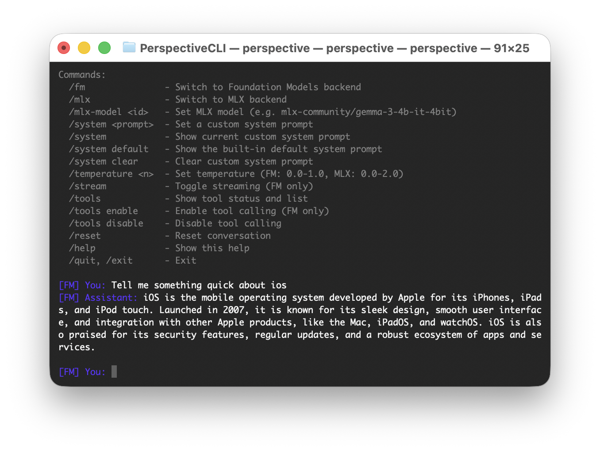

# PerspectiveCLI

[](https://github.com/techopolis/PerspectiveCLI/releases)
[](https://github.com/techopolis/PerspectiveCLI/stargazers)
[](LICENSE)
[]()
[]()

A lightweight, open-source Swift CLI for running **Apple Foundation Models** and **MLX models** on your Mac.



## Requirements

- macOS 26+ (Tahoe)
- Apple Silicon (M1 or later)
- Xcode 26+
- Swift 6.0+

Foundation Models requires Apple Intelligence to be enabled. MLX mode works on any Apple Silicon Mac.

## Install

### Homebrew

```bash
brew install techopolis/tap/perspective
```

### Shell Script

The quickest way to install without Homebrew:

```bash
curl -fsSL https://raw.githubusercontent.com/techopolis/PerspectiveCLI/main/scripts/remote-install.sh | bash
```

### Manual Download

Download the latest release archive from [Releases](https://github.com/techopolis/PerspectiveCLI/releases), then:

```bash
tar xzf perspective-cli-*.tar.gz
cd perspective-cli-*
sudo ./install.sh
```

This installs to `/usr/local/bin` (requires `sudo` because the directory is owned by root on macOS). If `/usr/local/bin` isn't on your PATH, the script will tell you how to add it.

To uninstall:

```bash
sudo ./install.sh --uninstall
```

## Build from Source

```bash
git clone https://github.com/your-username/PerspectiveCLI.git
cd PerspectiveCLI
./build.sh
swift run PerspectiveCLI
```

To create a release archive:

```bash
./build.sh dist
```

## Usage

### Command-Line Arguments

Run with `--prompt` for one-shot mode (no REPL, clean output for piping):

```bash
perspective --fm --prompt "What is Swift?"
perspective --mlx --prompt "Hello"
perspective --mlx --mlx-model mlx-community/gemma-3-4b-it-4bit --prompt "Hi"
perspective --temperature 0.5 --system "Be brief" --prompt "Explain recursion"
```

| Argument | Short | Value | Description |
|----------|-------|-------|-------------|
| `--fm` | | | Use Foundation Models backend |
| `--mlx` | | | Use MLX backend |
| `--model` | `-m` | `<model-id>` | Set MLX model |
| `--prompt` | `-p` | `<text>` | Send prompt and exit (one-shot mode) |
| `--temperature` | `-t` | `<float>` | Set temperature (FM: 0.0-1.0, MLX: 0.0-2.0) |
| `--stream` | `-s` | | Enable streaming output (FM) |
| `--system` | | `<text>` | Set a custom system prompt |
| `--tools` | | | Enable tool calling (FM) |
| `--adapter` | | `<path>` | Load a `.fmadapter` file (FM) |
| `--help` | `-h` | | Show usage help |

Without `--prompt`, arguments pre-configure the interactive REPL:

```bash
perspective --mlx                # enter REPL with MLX pre-selected
perspective --fm --tools         # enter REPL with FM + tools enabled
perspective --fm --adapter ~/my-adapter.fmadapter --prompt "Hello"
```

### Interactive REPL

Type messages to chat. Use slash commands to control the CLI:

### Backend Commands

| Command | Description |
|---------|-------------|
| `/fm` | Switch to Foundation Models backend |
| `/mlx` | Switch to MLX backend |
| `/mlx-model <id>` | Set MLX model (e.g. `mlx-community/gemma-3-4b-it-4bit`) |
| `/temperature <n>` | Set temperature (FM: 0.0-1.0, MLX: 0.0-2.0, default: 0.7) |
| `/stream` | Toggle streaming (FM only) |
| `/reset` | Reset conversation |

### Adapter Commands

Load custom-trained Foundation Models adapters (`.fmadapter` files):

| Command | Description |
|---------|-------------|
| `/adapter <path>` | Load a `.fmadapter` file (FM only) |
| `/adapter` | Show currently loaded adapter |
| `/adapter clear` | Remove loaded adapter and revert to default model |

### Tool Commands

Tools are disabled by default. Enable them for the FM backend:

| Command | Description |
|---------|-------------|
| `/tools` | Show tool status and list registered tools |
| `/tools enable` | Enable tool calling (FM only) |
| `/tools disable` | Disable tool calling |

### System Prompt Commands

| Command | Description |
|---------|-------------|
| `/system <prompt>` | Set a custom system prompt |
| `/system` | Show current custom system prompt |
| `/system default` | Show the built-in default system prompt |
| `/system clear` | Clear custom system prompt |

### Other

| Command | Description |
|---------|-------------|
| `/status` | Show Foundation Models availability and current settings |
| `/help` | Show help |
| `/quit`, `/exit` | Exit |

### Example

```
[FM] You: What is iOS?
[FM] Assistant: iOS is Apple's mobile operating system...

[FM] You: /tools enable
[OK] Tools enabled

[FM] You: What's the weather in San Francisco?
  [Tool] getWeather: San Francisco
[FM] Assistant: The current weather in San Francisco is 72°F and sunny.

[FM] You: /mlx
[OK] Switched to MLX backend

[MLX:gemma-3-1b-it-qat-4bit] You: Tell me a joke
[MLX] Assistant: Why do programmers prefer dark mode? ...
```

## Adding Your Own Tools

1. Create a tool in `Sources/PerspectiveCLI/Tools/`:

```swift
import Foundation
import FoundationModels

struct MyCustomTool: Tool {
    let name = "myTool"
    let description = "Description of what your tool does."

    @Generable
    struct Arguments {
        @Guide(description: "Parameter description.")
        var query: String
    }

    func call(arguments: Arguments) async throws -> String {
        return "Result for: \(arguments.query)"
    }
}
```

2. Register it in `Sources/PerspectiveCLI/Tools/ToolRegistry.swift`:

```swift
private init() {
    register(ExampleWeatherTool())
    register(MyCustomTool())
}
```

3. Build and run. Enable tools with `/tools enable` to use them.

## Architecture

```
Sources/PerspectiveCLI/
├── PerspectiveCLI.swift               # Entry point + chat loop + commands
├── Backends/
│   ├── FoundationModelsBackend.swift  # Apple FM with native tool calling
│   └── MLXBackend.swift               # MLX open-weight models via mlx-swift
├── Tools/
│   ├── ToolRegistry.swift             # Central tool registry
│   └── ExampleWeatherTool.swift       # Example tool (mock weather data)
└── Models/
    ├── CLIModels.swift                # In-memory conversation tracking
    └── FoundationModelCoordinator.swift
```

- **FM backend**: Tools are passed to `LanguageModelSession` which handles calling them natively. Only active when tools are enabled.
- **MLX backend**: Runs open-weight models from HuggingFace via [mlx-swift](https://github.com/ml-explore/mlx-swift). Models are downloaded and cached on first use. Supports both LLM and VLM models.
- **ToolRegistry**: Register a tool once, it's available to both backends.

## License

MIT License. See [LICENSE](LICENSE) for details.
